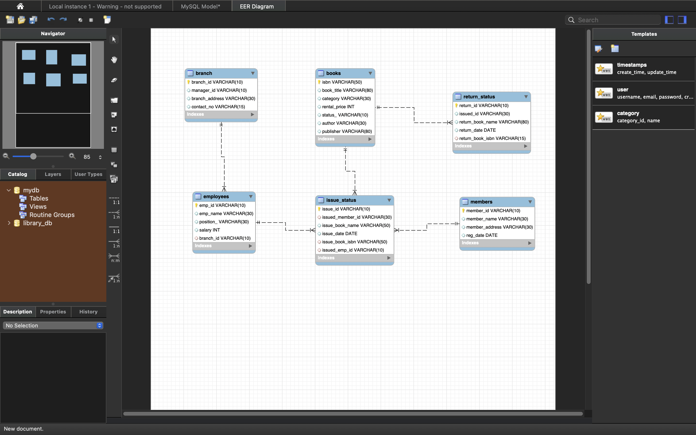

# Library Management System using SQL

## 📚 Project Overview

The Library Management System is a database-driven project developed using SQL to manage library operations such as book inventory, member registration, book issuance, returns, and branch performance tracking.

The project demonstrates database design, data manipulation, reporting, and automation using advanced SQL concepts including Joins, Aggregations, CTAS, Stored Procedures, and Business Reporting.

---

## 🎯 Objectives

* Design and implement a relational database for library operations.
* Manage books, members, employees, and branches efficiently.
* Track issued and returned books.
* Generate business reports for library performance.
* Automate return processing using stored procedures.
* Analyze member activity and rental revenue.

---

## 🛠️ Technologies Used

* MySQL
* SQL
* MySQL Workbench
* Microsoft Excel

---

## 🗄️ Database Schema

The system consists of the following tables:

### Branch

Stores branch details.

### Employees

Stores employee information and branch assignments.

### Members

Stores registered library members.

### Books

Maintains book inventory and availability status.

### Issue Status

Tracks books issued to members.

### Return Status

Tracks returned books and return dates.

---

## 📂 Entity Relationships
## 🗂️ Entity Relationship Diagram (ERD)


---

## 🔍 Features Implemented

### Book Management

* Add new books
* Update book records
* Track book availability
* Categorize books by genre

### Member Management

* Register members
* Update member details
* Track active members

### Issue & Return Management

* Issue books to members
* Record book returns
* Track overdue books
* Update inventory status automatically

### Branch Management

* Manage branch records
* Assign employees to branches
* Generate branch performance reports

---

## 📊 SQL Operations Performed

### CRUD Operations

* INSERT
* UPDATE
* DELETE
* SELECT

### Joins

* INNER JOIN
* LEFT JOIN

### Aggregations

* COUNT()
* SUM()
* AVG()

### Advanced SQL

* GROUP BY
* HAVING
* Subqueries
* CREATE TABLE AS SELECT (CTAS)
* Stored Procedures
* Business Reporting Queries

---

## 🚀 Business Problems Solved

### 1. Member Activity Analysis

Identified members who issued multiple books.

### 2. Revenue Analysis

Calculated rental income generated by each book category.

### 3. Inventory Analysis

Created reports for frequently issued books.

### 4. Recent Member Tracking

Identified members registered within the last 180 days.

### 5. Overdue Book Detection

Generated reports for members with overdue books and calculated overdue duration.

### 6. Branch Performance Report

Analyzed:

* Books issued
* Books returned
* Revenue generated by each branch

### 7. Active Member Identification

Created a separate table of recently active members.

### 8. Automated Return Processing

Implemented a stored procedure to:

* Record returns
* Update book availability
* Generate confirmation messages

---

## 💻 SQL Concepts Demonstrated

* Database Design
* Primary Keys
* Foreign Keys
* Referential Integrity
* Aggregate Functions
* GROUP BY and HAVING
* Joins
* Subqueries
* CTAS (Create Table As Select)
* Stored Procedures
* Date Functions
* Data Validation
* Reporting Queries

---

## 📈 Key Insights Generated

* Most active library members
* Highest revenue-generating book categories
* Frequently borrowed books
* Branch-wise performance metrics
* Overdue book statistics
* Active member engagement trends

---

## 📁 Project Structure

```text
Library-Management-System/
│
├── libraryp1.sql
├── lms_project_advanced_solution.sql
├── README.md
└── screenshots/
```

---

## 💼 Resume Highlights

* Designed and implemented a relational database system for managing library operations.
* Developed complex SQL queries using Joins, Aggregate Functions, HAVING clauses, and Subqueries.
* Automated book return processing using Stored Procedures.
* Generated branch performance, inventory utilization, and member activity reports.
* Applied database normalization principles and relational database design concepts.

---

## 🔮 Future Enhancements

* Web-based Library Management Dashboard
* Role-Based Access Control
* Fine Calculation System
* Book Reservation Module
* Power BI Analytics Dashboard
* Email Notifications for Due Dates

---

## 👨‍💻 Author

**Akshay Gupta**

Final Year Computer Science Engineering Student
MBM University, Jodhpur

---

